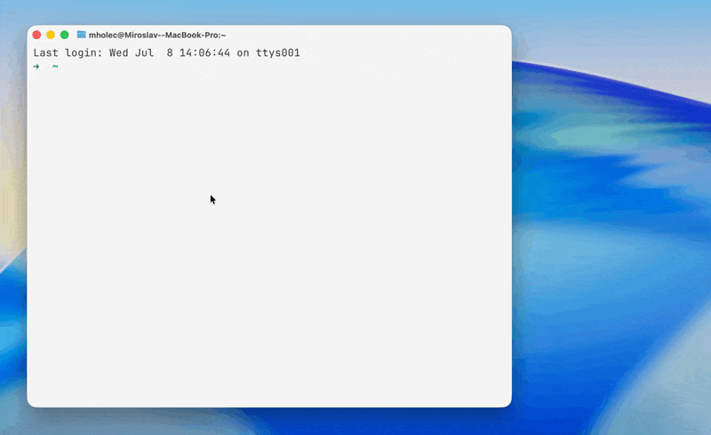

# MCP Designer

**Stop hand-writing MCP boilerplate. Design your server visually, ship the contract.**

> Define your entire MCP server — identity, transports, auth, tools, resources, prompts — in a visual editor. Get a clean `*.mcp.yaml` on disk. Scaffold, document and configure from one source of truth.

[](https://www.npmjs.com/package/mcp-designer)
[](LICENSE)
[]()

```bash
npx mcp-designer
```

*100% local · no account · no cloud · no telemetry*

<!-- HERO GIF/SCREENSHOT HERE — this is the single most important element -->


---

## Why design-first?

Writing an MCP server by hand means juggling tool schemas, transport config and
auth across scattered code — and rewriting docs and client config every time
something changes. OpenAPI solved this for REST. **MCPDS does it for MCP.**

You design the contract once. Implementation, docs, client configuration and
registry entries all follow it — not the other way around.

| Without MCP Designer | With MCP Designer |
|---|---|
| Hand-write tool schemas in code | Visual JSON Schema builder |
| Config drift between code and docs | One `*.mcp.yaml` source of truth |
| Validate by running & failing | Live validation with inline errors |
| Cloud tools that see your spec | Runs entirely on your machine |

---

## What you get

- **Visual editors** for every MCPDS section — identity, transports, auth, tools, resources, prompts, components, packaging.
- **JSON Schema builder** for tool input/output and prompt arguments — no more hand-writing schema by hand.
- **Live validation** against the MCPDS schema with inline errors.
- **Lossless YAML round-trip** — untouched files save byte-for-byte.
- **Full file management** — templates, rename, duplicate, import by drop or paste.
- **Local-first** — point it at a folder, get clean YAML on disk. That's it.

---

## Quick start

```bash
npx mcp-designer [workspace-dir]
```

Opens a local editor in your browser. `[workspace-dir]` defaults to the current
directory. The server binds to `127.0.0.1` — nothing leaves your machine.

<details>
<summary>Install globally / other run options</summary>

**Global install:**
```bash
npm install -g mcp-designer
mcp-designer [workspace-dir]
```

- `MCP_DESIGNER_PORT` — choose a specific port.
- `MCP_DESIGNER_NO_OPEN=1` — skip auto-opening the browser.

**Requirements:** Node.js 20+ and npm.
</details>

---

## Built on MCPDS

MCP Designer reads and writes **[MCPDS (MCP Design Specification)](https://www.npmjs.com/package/@mcpds/spec)**:
a single, human-authored `*.mcp.yaml` that fully describes an MCP server and
serves as the source of truth for scaffolding, documentation, client
configuration and registry entries.

---

<details>
<summary><b>Contributing & development</b></summary>

TypeScript npm-workspaces monorepo.

| Package | Name | Responsibility |
|---|---|---|
| `packages/core` | `@mcp-designer/core` | MCPDS types, YAML parse/serialize, schema validation. |
| `packages/server` | `mcp-designer` | Published npm package + CLI, local Express REST API. |
| `packages/web` | `@mcp-designer/web` | React + Vite single-page editor. |

**Run from source:**
```bash
npm install
./scripts/run.sh [workspace-dir]   # macOS/Linux
scripts\run.bat [workspace-dir]    # Windows
```

**Develop:**
```bash
npm run dev -w mcp-designer         # server + CLI
npm run dev -w @mcp-designer/web    # Vite dev server
npm run typecheck && npm test
```
</details>

## From spec to server

The **[@mcpds/spec](https://www.npmjs.com/package/@mcpds/spec)** repo ships a
skill that turns your `*.mcp.yaml` into working code. Design the contract in
MCP Designer, then let the skill scaffold the entire MCP server from it —
tools, transports and auth wired up straight from the spec.

Design-first, end to end: **visual editor → `*.mcp.yaml` → generated server.**

## License

[MIT](LICENSE) — created by Miroslav Holec ([@mirekholec](https://github.com/mirekholec)).